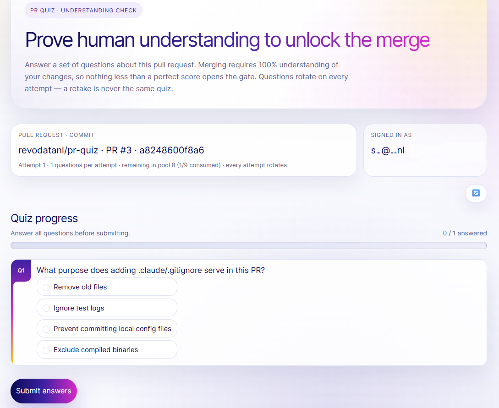
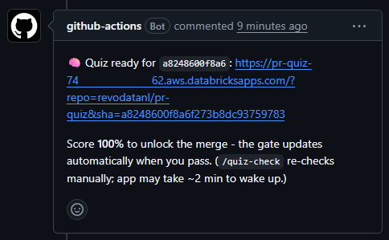
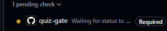

# pr-quiz — an AI quiz merge gate for pull requests

[](https://github.com/revodatanl/pr-quiz/actions/workflows/ci.yml)
[](LICENSE)

pr-quiz makes a pull request prove its author (or a reviewer) understood the
change before it can merge. When a PR opens, a Databricks job reads the diff and
uses an AI model to generate a multiple-choice quiz about it; a web app
serves the quiz, and the PR can merge to the protected branch only when the
latest published quiz result for its head commit scored 100%.



## Quickstart

You need the Databricks CLI, GitHub CLI (`gh`), and Python 3.10+ on `PATH` —
full prerequisites in [docs/adopting.md](docs/adopting.md).

```bash
# Preflight: CLIs present and authenticated.
python installer/pr_quiz_install.py doctor

# Backend (workspace admin, once): deploy the bundle + tables, store the
# GitHub token secret, create a CI service principal (a machine identity
# for automation), apply grants. Writes pr-quiz-backend.json for adopters.
python installer/pr_quiz_install.py backend --profile <profile>

# Onboard a repo (maintainer, per repo): open a PR adding the caller
# workflows, set secrets/variables, configure quiz-gate branch protection.
python installer/pr_quiz_install.py onboard --repo owner/name
```

Every step is safe to re-run (re-runs report `[skip]` and change nothing),
`--dry-run` prints mutating commands without executing, and nothing
destructive happens without `--force`. See
[docs/adopting.md](docs/adopting.md) and
[docs/operating.md](docs/operating.md) for full walkthroughs, manual
fallbacks, and troubleshooting.

## How it works

1. A PR opens (or someone comments `/quiz`). Onboarding added a small
   **caller workflow** to your repo; it invokes pr-quiz's **reusable
   workflow** (shared GitHub Actions logic pr-quiz publishes), which sets the
   `quiz-gate` status to pending, wakes the quiz app, and starts a Databricks
   job. Waived authors (`QUIZ_WAIVE_AUTHORS`) skip straight to a passing
   status.
2. The job reads the diff and writes a pool of questions, sized to the diff,
   to a Databricks table.
3. A bot comment links the quiz. Each attempt samples fresh questions and is
   graded instantly.

   

4. A 100% score turns `quiz-gate` green and unlocks the merge. A new commit
   resets it to pending; comment `/quiz` for a fresh quiz or `/quiz-check` to
   re-check a commit that already passed.

Design diagram: [quiz-merge-gate.mermaid](quiz-merge-gate.mermaid).

## Read this before you wire a repo

- **`/quiz` is dead until the caller workflow reaches your default branch.**
  GitHub only runs `issue_comment` workflows from the default branch. Merge
  the onboarding PR first; only then does `/quiz` do anything.
- **The `pull_request: branches:` filter lives in your caller workflow**, not
  the reusable one. Set it — and keep `QUIZ_TARGET_BRANCH` in sync — to the
  branch your gate protects.
- **The app sleeps and takes about 2 minutes to wake.** The `/quiz` workflow
  pre-starts it, but the first load after idle is slow.
- **Pin the reusable workflows to `@v1` or a commit SHA, never a moving
  branch.** See [SECURITY.md](SECURITY.md).



## Topologies

Most orgs use a **shared multi-tenant backend**: deploy it once, and every
repo's caller workflow points at it (quiz results are keyed by repo and
commit, so nothing collides). Teams that need an isolated workspace, catalog,
or cost center instead run `databricks bundle init` for a **per-team
backend** they operate themselves. Full trade-offs in
[docs/adopting.md](docs/adopting.md#topologies).

## Documentation

- [docs/adopting.md](docs/adopting.md) — adopter guide: prerequisites,
  installer walkthrough, configuration reference, manual fallback,
  troubleshooting.
- [docs/operating.md](docs/operating.md) — backend operator: deploying,
  grants, secret and token rotation, warehouse cost, teardown.
- [docs/threat-model.md](docs/threat-model.md) — assets, actors, trust
  boundaries, accepted risks, v2 mitigations.
- [SECURITY.md](SECURITY.md) — reporting and the v1 trust model.
- [CONTRIBUTING.md](CONTRIBUTING.md) — development setup, fixture PRs, repo
  layout.
- [RELEASING.md](RELEASING.md) · [CHANGELOG.md](CHANGELOG.md).
